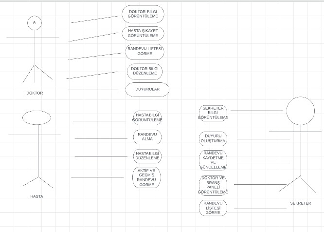

<h1><b>GÜMÜŞOLUK HASTANESİ RANDEVU OTOMASYONU</b></h1>

<b><h2>Proje Özeti:</h2></b>HASTA DOKTOR VE SEKRETER OLARAK ÜÇ TANE GİRİŞİMİZ OLACAK.Her birisi kendi butonuyla giriş yaptıktan sonra kendi ile ilgili işlemleri yapabilecektir.BU proje dil olarak C# Veritabanı olarak MSSQL kullanılmıştır. 

 
USE CASE DİAGRAM:

 

Hasta Girişi: Hasta TC kimlik no ve veritabanında kayıtlı şifresi ile giriş yapmaktadır.Eğer kaydı yoksa üye ol butonu ile kayıt olacaktır.

Eğer hasta kayıtlı değilse üye ol kısmına tıkladıktan sonra hasta kayıt formuna yönlenir.Hasta kayıt kısmında adını soyadını tcsini telefon ve şifresini girdikten sonra kayıt yap butonuna tıklayarak hastaneye kayıt olur ve veritabanına kendi bilgilerini kaydeder.

Hasta  hastagiris.cs formundan tc kimlik no ve şifresi ile giriş yaptıktan sonra kendini hastadetay.cs formuna yönlendirir hasta detay kısmında ise hasta kişi bilgi kısmından kendine ait bilgileri görebilir randevu paneli kısmında branş doktor ve şikayet kısmını seçerek  randevu alabilir.Bilgilerini düzenle kısmından ise kendine ait bilgilerde güncelleme yapabilir.randevu geçmişi kısmından kendine ait eski randevuları aktif randevular kısmından şimdiki randevuları görebilir.

 
 
Doktor girişi: doktor Tc kimlik no ve veritabanında kayıtlı şifresi ile sisteme giriş yapacaktır.sisteme giriş yaptıktan sonra frmdoktorgiris.cs formundan frmdoktor detay formuna yönlenecektir.Frmdoktor_detay formunda doktor bilgi kısmında doktorun TCNO VE Ad Soyadı olacaktır.Randevu detay kısmında hastanın şikayeti olacak randevu listesi kısmında doktor aktif randevularını görüntüleyebilecektir.hızlı erişim kısmında ise bilgi düzenle butonu ile kendi bilgilerini düzenleyebilecek duyurular butonu ile aktif duyuruları görüntülebilecek çıkış kısmından çıkacaktır. 
 
 
 
Sekreter Girişi: Sekreter Tc kimlik no ve Veritabanında kayıtlı şifresi ile başarılı giriş yaptıktan sonra frmsektergiris.cs formundan frm sekreter detay formuna yönlenecektir.Frmsekreterdetay.cs formunda sekreter bilgi kısmında sekreter ile bilgileri duyuru oluştur kısmı ile yeni bir duyuru oluşturmayı randevu paneli ile yeni bir randevu oluştumayı veya güncellemeyi  hızlı erişim yeri ile doktor paneli branş paneli ve randevu listesini görüntüleyecektir.Branşlar ve randevu listesi kısmından datagridwiev ile aktif olanları görüntüleyecektir.
 
 

